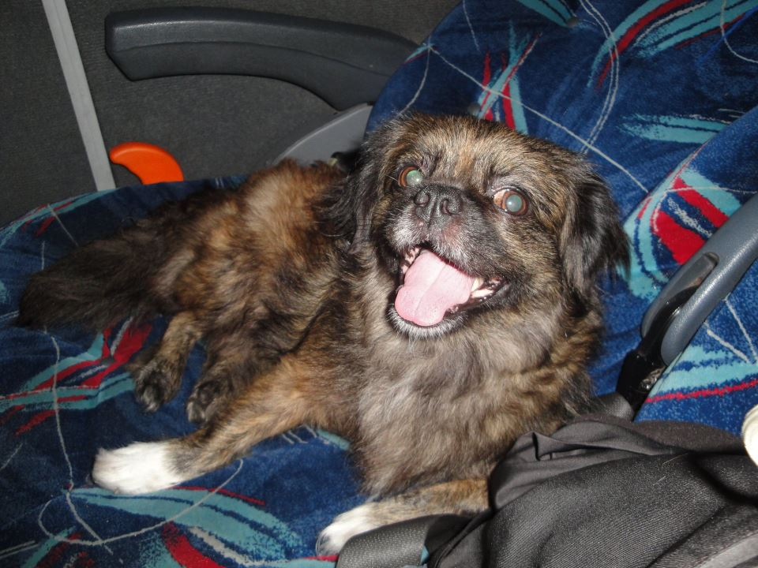
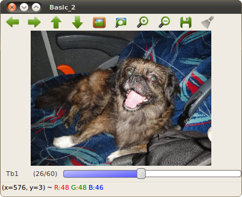
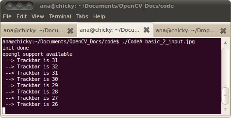
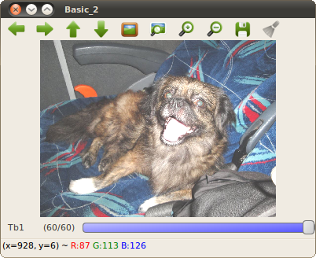

.. _basic_2:

Trackbar and Pixel Operations
*****************************

Goals
=====
At the end of this tutorial the reader should be able to:

#. Use :trackbar:`Trackbars <>` in his/her OpenCV applications
#. Do simple arithmetic operations with a :mat:`Mat <>` and a :scalar:`Scalar <>` (i.e. change pixel intensity values)

C++ Code
========

Sample code is shown below:

.. code-block:: cpp

   #include "opencv2/core/core.hpp"
   #include "opencv2/highgui/highgui.hpp"
   #include <stdio.h>

   // Function declaration
   void tbCallback( int _val, void* _data );

   // main
   int main( int argc, char* argv[] ) {
  
	// Create a Mat object and read an image 
  	cv::Mat img;
  	img = cv::imread( argv[1], -1 );
  
	cv::namedWindow( "Basic_2", cv::WINDOW_NORMAL );
  
	// Create a Trackbar
  	int tbVal = 30;
  	int tbMaxVal = 60;
  	cv::createTrackbar( "Tb1", "Basic_2", &tbVal, tbMaxVal, tbCallback );

  	// Display
  	imshow( "Basic_2", img );

	// Wait until a key is pressed
  	cv::waitKey(0);

  	return 0;
  
   }

   // @function tbCallback
   void tbCallback( int _val, void* _data ) {
   	printf(" --> Trackbar is %d \n", _val );
   }

For an image input like this:

|basic_2_input|

The output is shown below. The terminal image shows the output of the ``tbCallback`` function

+------------------------------+------------------------------+
| |basic_2_outputA1|           | |basic_2_outputA2|           |
+------------------------------+------------------------------+

C++ Code 2
----------

The code above is not particularly useful. Let us use the trackbar value o modify the image shown in the window. 

.. code-block:: cpp

   #include "opencv2/core/core.hpp"
   #include "opencv2/highgui/highgui.hpp"
   #include <stdio.h>

   // Function declaration
   void tbCallback( int _val, void* _data );

   // Function main
   int main( int argc, char* argv[] ) {
  
	// Create a Mat object and read an image 
   	cv::Mat img;
   	img = cv::imread( argv[1], -1 );

	// Create a window  
   	cv::namedWindow( "Basic_2", cv::WINDOW_NORMAL );
  
	// Create a Trackbar in the window just created
   	int tbVal = 25;
   	int tbMaxVal = 60;
   	void *pImg = &img;
   	cv::createTrackbar( "Tb1", "Basic_2", &tbVal, tbMaxVal, tbCallback, pImg );

   	// Display original image
   	imshow( "Basic_2", img );

  	// Wait until a key is pressed
 	cv::waitKey(0);

  	return 0;
  
   }

   // function tbCallback
   void tbCallback( int _val, void* _data ) {

   	// Cast the void pointer to Mat*
  	cv::Mat* pImg; 
  	pImg = static_cast<cv::Mat*>(_data);

  	// Use the Trackbar value and _data to modify the image displayed
  	cv::Mat img_modified;
  	img_modified = *pImg + cv::Scalar(_val, _val, _val);

  	// Display the modified image
  	imshow( "Basic_2", img_modified );
  
   }

The output of executing ``./basic_2B image.jpg`` and a trackbar value of 60 is:

|basic_2_outputB|

.. Images references

