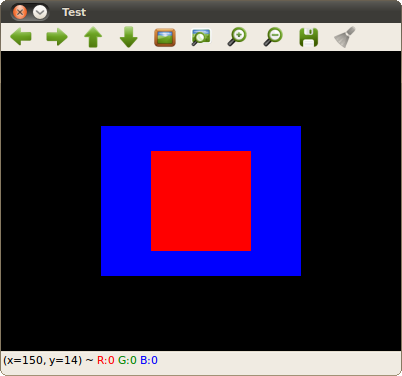

.. _basic_matrix_1:

First program
*************

Goals
=====

At the end of this tutorial the reader should be able to:

#. Use the :mat:`Mat <>` class to create images.
#. Use basic GUI functions to create windows and display images on them.

C++ Code
========

Sample code is shown below:

.. code-block:: cpp

   #include "opencv2/core/core.hpp"
   #include "opencv2/highgui/highgui.hpp"

   int main( int argc, char* argv[] ) {

	// Create a matrix initialized to zeros (black)
	cv::Mat m = cv::Mat::zeros( 300, 400, CV_8UC3 );

	// Set some matrix elements to green
	cv::Mat roi_green( m, cv::Rect( 100, 75, 200, 150) );
	roi_green = cv::Scalar( 0, 255, 0 );   

	// Set some matrix elements to red
	cv::Mat roi_red( m, cv::Rect( 150, 100, 100, 100) );
	roi_red = cv::Scalar( 0, 0, 255 );

	// Create a named window
	cv::namedWindow( "Test", cv::WINDOW_AUTOSIZE );

	// Display
	imshow( "Test", m );

	// Wait until a key is pressed
	cv::waitKey(0);

	 return 0;	
   } 

And the output is here:

|basic_Fig1|

Explanation
===========

#. The first two lines are OpenCV headers that you will use regularly:

   * *core.hpp*:  Defines OpenCV data types (such as Mat)
   * *highgui.hpp*: Defines GUI tools

   Also note that OpenCV classes and functions are defined into the :cv_namespace:`cv namespace <>`

#. Then we create a Mat object:

   .. code-block:: cpp

      cv::Mat m = cv::Mat::zeros( 300, 400, CV_8UC3 );

#. In order to display our matrix, we create a window object:

   .. code-block:: cpp

      cv::namedWindow( "Test", cv::WINDOW_AUTOSIZE );   

#. And we display it

   .. code-block:: cpp

      imshow( "Test", m );

#. Finally, we use :wait_key:`waitKey <>` to wait for a pressed key 

   .. code-block:: cpp

      waitKey(0);

   the argument sets the delay (in ms). A value of 0 indicates an infinite delay. 

Compilation
===========

Here a sample CMakeLists.txt file for the file above:

     .. code-block:: cmake

        cmake_minimum_required ( VERSION 2.8 )
        project( Tutorials )

        set( CMAKE_INSTALL_PREFIX /usr/local )
        set( CMAKE_CXX_COMPILER "g++-4.4" )
        set( CMAKE_CXX_FLAGS "-L /usr/local/lib" )

        include_directories( .
			     /usr/local/include )

        set ( SRC_FILES T2_matrix.cpp )
        set ( HDR_FILES )
        set ( OpenCV_LIBS opencv_core opencv_highgui )

	add_executable ( Code ${SRC_FILES} ${HDR_FILES} )
	target_link_libraries( Code ${OpenCV_LIBS} )
