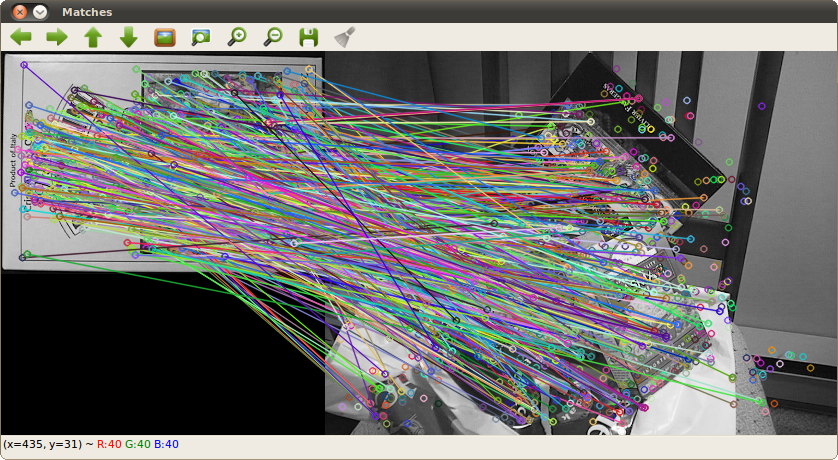

.. _nonfree_1:

SURF Descriptor + BFMatcher
***************************

Goals
=====

At the end of this tutorial the reader should be able to:

#. To use the :surf_operator:`SURF Operator <>` to detect keypoints and get their descriptors
#. Match sets of keypoints by using :bf_matcher:`BFMatcher <>`

C++ Code
========

.. code-block:: cpp

   #include <stdio.h>	
   #include <iostream>	
   #include "opencv2/core/core.hpp"
   #include "opencv2/highgui/highgui.hpp"

   // For SURF
   #include "opencv2/nonfree/features2d.hpp"

   // For common feature2D 
   #include "opencv2/nonfree/features2d.hpp"

   // Functions declaration
   void readme();

   // main
   int main( int argc, char** argv ) {
       cv::Mat img_1 = cv::imread( argv[1], CV_LOAD_IMAGE_GRAYSCALE );
       cv::Mat img_2 = cv::imread( argv[2], CV_LOAD_IMAGE_GRAYSCALE );
  
	if( !img_1.data || !img_2.data )
  	    { return -1; }

  	//-- Step 1: Detect the keypoints and generate their descriptors using SURF
  	int minHessian = 400;
  	cv::SURF surf( minHessian );
 
	std::vector<cv::KeyPoint> keypoints_1, keypoints_2;
  	cv::Mat descriptors_1, descriptors_2;

  	surf( img_1, cv::Mat(), keypoints_1, descriptors_1, false );
  	surf( img_2, cv::Mat(), keypoints_2, descriptors_2, false );

  	//-- Step 3: Matching descriptor vectors with a brute force matcher
  	cv::BFMatcher matcher( cv::NORM_L2, false );
  	std::vector< cv::DMatch > matches;
  	matcher.match( descriptors_1, descriptors_2, matches );

  	//-- Draw matches
  	cv::Mat img_matches;
  	cv::drawMatches( img_1, keypoints_1, img_2, keypoints_2, matches, img_matches ); 

  	//-- Show detected matches
  	imshow("Matches", img_matches );

  	cv::waitKey(0);

       return 0;
       }

       // function readme
       void readme()
       { std::cout << " Usage: ./SURF_descriptor <img1> <img2>" << std::endl; }

Compilation
===========

.. code-block:: cmake

   cmake_minimum_required ( VERSION 2.8 )
   project( Tutorials )

   set( CMAKE_INSTALL_PREFIX /usr/local )
   set( CMAKE_CXX_COMPILER "g++-4.4" )
   set( CMAKE_CXX_FLAGS "-L /usr/local/lib" )

   include_directories( .
		        /usr/local/include )

   set ( OpenCV_LIBS opencv_core
		     opencv_highgui
                     opencv_nonfree
                     opencv_features2d )

   add_executable ( SURF_Descriptor SURF_Descriptor.cpp )
   target_link_libraries( SURF_Descriptor ${OpenCV_LIBS} )

The output of two input images such as:

+------------------------------+------------------------------+
| |nonfree_1_input1|           | |nonfree_1_input2|           |
+------------------------------+------------------------------+

is:

|nonfree_1_output|

.. Images references

.. |nonfree_1_input1| image:: nonfree_1_input1.png
   		              :align: middle
   		              :height: 250pt

.. |nonfree_1_input2| image:: nonfree_1_input2.png
   		              :align: middle
   		              :height: 250pt

